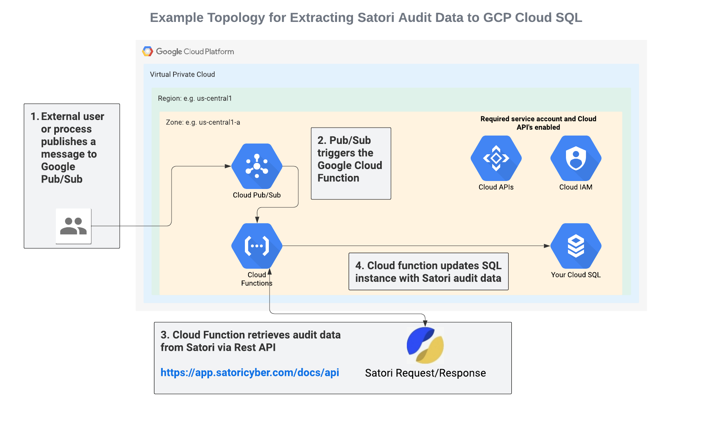
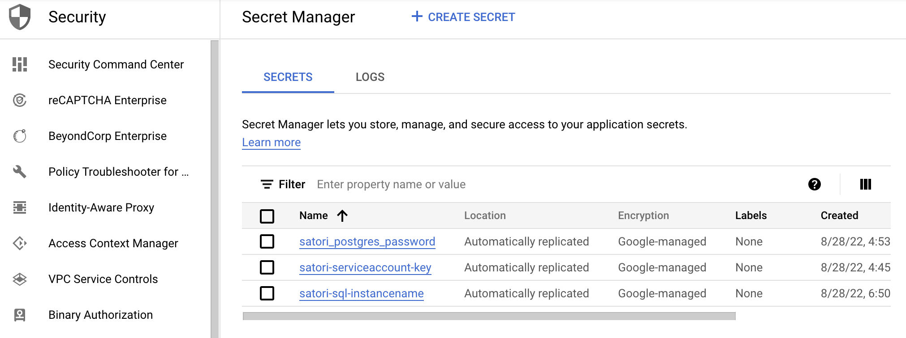
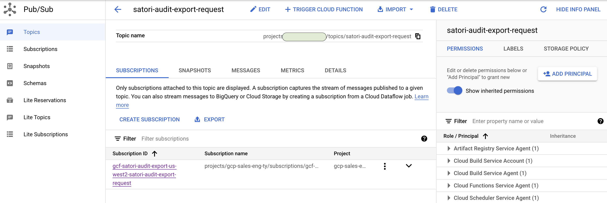
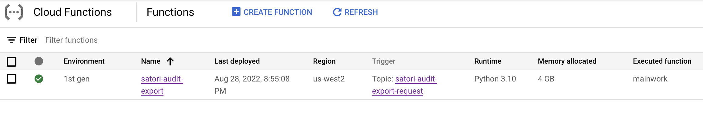
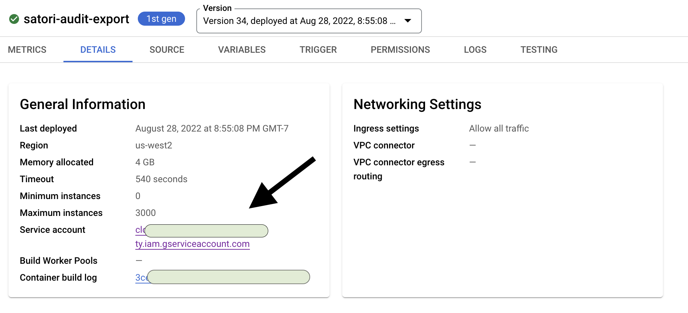
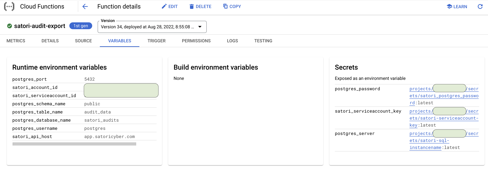
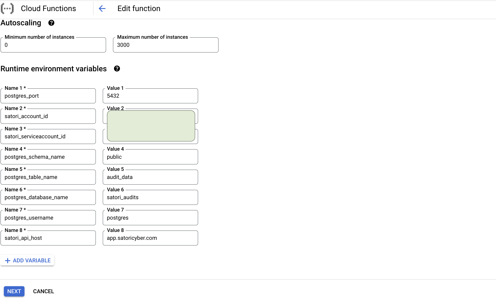
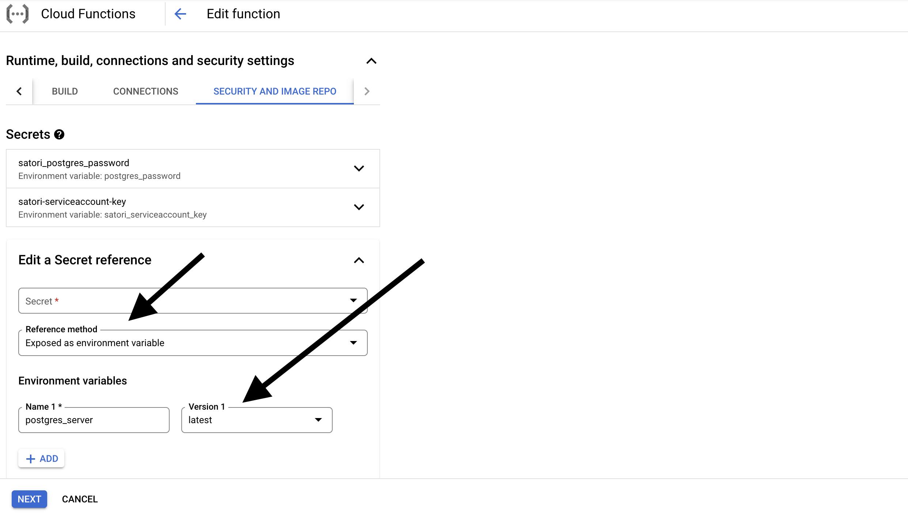
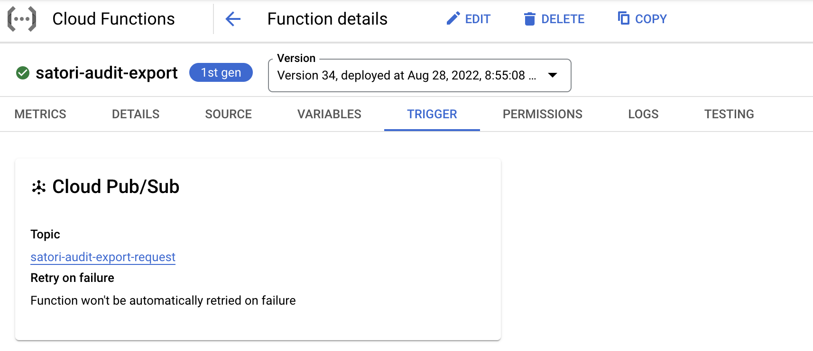
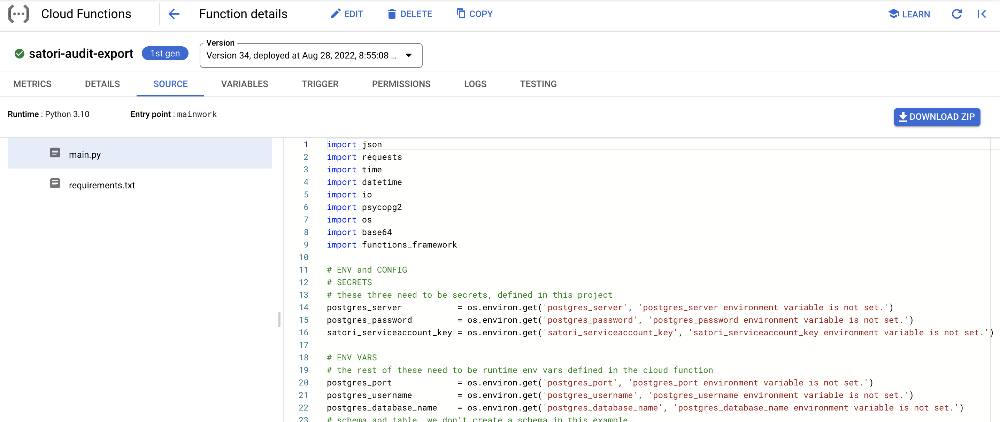

# GCP solution for exporting Satori audit data to postgresDB

**This project walks through setup and configuration for exporting your Satori audit data to a PostgresDB instance running in GCP. It uses the following GCP components:**

- various GCP API's which need to be enabled for your GCP project
	- This [GCP tutorial](https://cloud.google.com/functions/docs/tutorials/pubsub) walks you through the API's which need to be enabled
- GCP [Cloud Function](https://console.cloud.google.com/functions/list)
- GCP [Pub/Sub](https://console.cloud.google.com/cloudpubsub/)
- GCP [Secret Manager](https://console.cloud.google.com/security/secret-manager)
- GCP [Cloud SQL (Postgres)](https://console.cloud.google.com/sql/instances)

There are numerous ways to build this type of integration. The following notes and screenshots are meant as guidance for your production deployment options.

With some study, you can also implement this type of solution in Azure or AWS. For expediency and for a quick start, these instructions are 100% GCP specific.

**The end result is an operational datastore containing all of your Satori audit data, with a publishing and syncronization solution between Satori and your new cloud sql datastore. This information can then be used in various ways downstream from the Satori Platform.**



_Note: if you already have a SQL instance running somewhere and would like to use a simple python script / jupyter notebook, without setting up all of the infrastructure shown below, you may be interested in the following [gist](https://gist.github.com/northwestcoder/c7dec1e50b47d92d1f8eef55524ee14b)._

## GCP Environment

We recommend devoting a project to this solution
- isolates for billing purposes
- isolates for security and principal role assignments

We recommend in this dedicated project to create a single service account that has all of the required permissions for creating
- a cloud function
- a pub/sub channel
- a cloud sql instance

You can also use the gcloud command for many of the steps shown here. Gcloud installation info can be found [here](https://cloud.google.com/sdk/docs/install). For example, once installed, you can set your project and region:

```
gcloud config set project YOURPROJECTID
gcloud config set region YOURDESIREDREGION
```

## Satori Environment

You must have a valid Satori account for this solution. You will need to generate a service account id and secret. Instructions for that process are located [here](https://app.satoricyber.com/docs/api) in the "create a service account" section.


## Cloud SQL

- Create a PostgresDB instance and take note of the connection username, password, and database name.
- If you are using this project and quick start in its entirety, then you can create your cloud sql instance with just a private IP.
- Size the instance appropriately based upon your eventual Satori audit usage volume.
- Several GCP tutorials on cloud SQL are available [here](https://cloud.google.com/sql/docs/postgres/quickstarts)
- Once created, take note of your cloud SQL INSTANCE_NAME, it takes the form PROJECTNAME:REGION:DBNAME. You will need this in a later step.

## Cloud Secrets

- Create three secrets for this solution, their names must be exactly as shown:
	- satori-postgres-password
	- satori-sql-instancename
	- satori-serviceaccount-key 

Using the gcloud cli, you can run commands similar to the following, change the printf portion to the actual values for your environment:

```
printf "YOUR_PG_PASSWORD" | gcloud secrets create satori-postgres-password
printf "YOUR_SATORI_SERVICE_ACCOUNT_SECRET" | gcloud secrets create satori-serviceaccount-key
printf "YOUR_PG_GCP_INSTANCE_NAME" | gcloud secrets create satori-sql-instancename	

```

In the Google Console, your secrets should look like this:



## Cloud Pub/Sub

- Create a pub/sub topic in  GCP.
- This is what we will use to trigger our Cloud Function

In the Google Console, your pub/sub topic should look like the following. In this picture, we named our topic "satori-audit-export-request":



## Cloud Function

Our GCP Cloud Function will do the heavy lifting and perform the following tasks:
- Connect to PostgresDB and create a temp table
- Connect to the Satori Rest API and retrieve audit data
- Load that data into the temp table
- Copy from the temp table to the final destination table
- Drop the temp table

Satori audit data contains a unique key "flow_id". We are leveraging this to support referential integrity. Duplicate audit entries will never be created in the final table. The temp table step ensures this using a postgres 'on conflict' statement.

We have provided a [main.py](main.py) file and a [requirements.txt](requirements.txt) file as part of this solution. These can be used as-is with no modifications, assuming you follow all other steps in this readme.

There are several environment variables and three secrets that you will need to configure in this Cloud Function, which we outline below.

Here is the overview page, showing our newly created Cloud Function:



Here is the details page, showing our run-as service account. This should be a GCP project service account which has all of the necessary permissions for the various services described in this readme:



Here is the variables page, showing our various environment variables as well as references to three secrets:



When you are editing the variables for this cloud function, you need to define two groups of info. 

First, environment variables. In the cloud function, these are defined under "Runtime, Build, Connections and Security settings" and then "Runtime". All of the following must be defined with correct values for your environment.



And second, the three secrets you created earlier need to be referenced now. 

In the cloud function, these are defined under "Runtime, Build, Connections and Security settings" and then "Security and Image Repro". All of the following must be defined with correct values for your environment.

Notice we select "use as environment variable" as well as version "latest". 



**All of the above environment variables - both the run time variables as well as the secrets - need to be configured in order for this sample code to function correctly.**

Here is the triggers page, showing the trigger for this cloud function, note that it references the Pub/Sub topic you created above:



Here is the source page, showing the source code for this cloud function.
Notes:
- It references a [main.py](main.py) file and a [requirements.txt](requirements.txt) file. For each file, you can copy/paste the contents from this github project directly into the source code editor for the cloud function with no edits/changes.
- We used python runtime 3.10
- Notice the entry point is set to "mainwork". This is the python function in main.py that will be called whenever the Pub/Sub topic triggers it.
- Notice the top section of main.py retrieves the several environment variables - as well as the three secrets - in order to do its work:



***

At this point, you should have everything set up, including

- Your Satori account, with a service ID and secret created for the Rest API
- Your GCP sql database
- Your GCP secrets
- Your GCP Pub/Sub Topic
- Your GCP Cloud Function

To test it all out, you can send a message to your pub/sub topic. The message contains only an integer. This is "the number of days back in time for which we want to retrieve audit data".

Using the gcloud cli, you can run the following command:

```
gcloud pubsub topics publish satori-audit-export-request  --message="15"
```

This will trigger the cloud function and pass in "15" - the cloud function will retrieve the last 15 days of Satori audit information, _up to yesterday_, and then load it into the postgres table.

Because this solution supports referential integrity using the flow_id column as a primary key, you can safely run this command - or any similar date range - and duplicate entries will _not_ be copied.